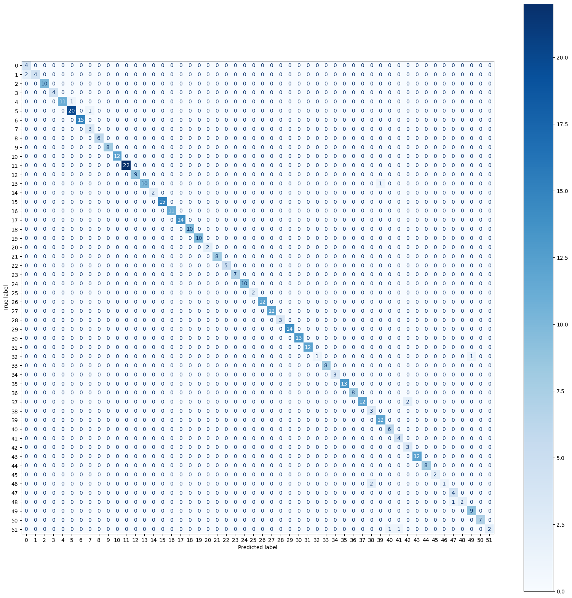
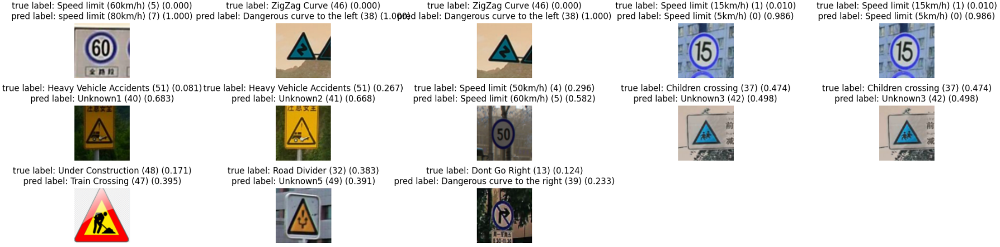

# Traffic Signs Classification with VGG-11

This project can help you understand how to implement and handle the dataset from Kaggle.

The repository contains an implementation of the VGG-11 model for classifying traffic signs. The model is trained using a dataset of traffic signs, and the goal is to correctly identify the class of each traffic sign.

## Project Overview

The key steps involved in this project include:
- Loading the traffic signs dataset from Kaggle.
- Preprocessing the images and labels.
- Defining and training a VGG-11 model using PyTorch.
- Evaluating the model's performance on the test set.

## Dataset

The dataset consists of traffic sign images, each belonging to a specific class of traffic signs. It includes various traffic sign categories such as stop signs, speed limits, and pedestrian crossings.

The dataset is loaded using Google Colab and Kaggle API.

## Model Architecture

The architecture of the model is based on **VGG-11**, a deep convolutional neural network. The architecture includes:
- Multiple convolutional layers for feature extraction.
- Batch normalization and dropout for regularization.
- Fully connected layers for final classification.

The model uses the **Adam** optimizer and **cross-entropy** loss for training.

## Training Process

The training process involves:
1. Setting up the random seed for reproducibility.
2. Loading the traffic sign dataset from Kaggle.
3. Preprocessing the images using transformations such as resizing, RandomAffine, normalization, and augmentation.
4. Defining the VGG-11 architecture using PyTorch.
5. Training the model over several epochs, monitoring training and validation loss/accuracy.
6. Evaluating the model on the test set.

## Results

The VGG-11 model shows strong performance on the traffic signs dataset, correctly identifying most traffic signs. The notebook includes visualizations of the training and validation metrics, as well as predictions on sample test images.

### Confusion Matrix :

### Incorrect Images with Labels : 

